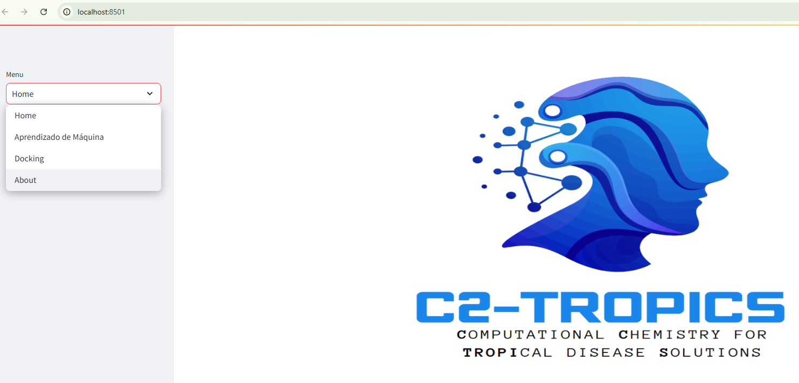

<p>
  
  <span style="font-size:24px; font-weight:bold; margin-left:10px;"></span><br>
  <span style="font-size:16px;">Computational Chemistry for Tropical Diseases Solutions</span>
</p>


C2TROPICS é uma plataforma computacional que permite analisar moléculas e prever sua atividade contra doenças tropicais, classificando-as como **Ativa** ou **Inativa**.

---

## Tutorial de Instalação e Uso

### 1. Acesse o GitHub
1. Entre no [repositório oficial do C2TROPIC](https://github.com/seu-usuario/c2tropic).  
2. Navegue até a pasta **`c2tropic-installation`**.  
 
---

### 2. Baixe a pasta
- Faça o download da pasta **`c2tropic-installation`** para o seu computador.
- Baixe o modelo treinado [Modelo](https://drive.google.com/file/d/1L1hs6gHG0NzzaVzcSt_swnjyXUGLa4G1/view?usp=share_link) e salve na mesma pasta do projeto  https://drive.google.com/file/d/1L1hs6gHG0NzzaVzcSt_swnjyXUGLa4G1/view?usp=share_link

---

### 3. Abra o Anaconda
- Inicie o **Anaconda Navigator** ou o **Prompt do Anaconda**.  


### 4. Crie e ative um ambiente (opcional, mas recomendado)
```bash
conda create -n c2tropic_env python=3.11
conda activate c2tropic_env
```

### 5. Navegue até a pasta:
cd caminho/para/c2tropic-installation
```bash
- pip install -r requirements.txt
- streamlit run projeto.py
```

### Sua plataforma terá essa cara:
<p>
  
  <span style="font-size:24px; font-weight:bold; margin-left:10px;"></span><br>
  <span style="font-size:16px;">Computational Chemistry for Tropical Diseases Solutions</span>
</p>

## 💁🏿Professor Orientador:

<a href="https://github.com/vieira86" target="_blank">
  
</a>  

**Rafael Vieira**  
Professor de Química no Instituto Federal de Rondônia, Rafael Vieira é especialista em química orgânica com ênfase em quimioinformática e aprendizado de máquina. Atua no desenvolvimento de soluções computacionais para problemas relacionados à química medicinal, combinando experimentação científica com ferramentas avançadas de modelagem molecular e análise de dados. Seu trabalho integra ensino, pesquisa e inovação, contribuindo para a formação de novos profissionais e para o avanço da química computacional aplicada a doenças tropicais.

🔗 [GitHub - @vieira86](https://github.com/vieira86)  
[](https://github.com/vieira86)
